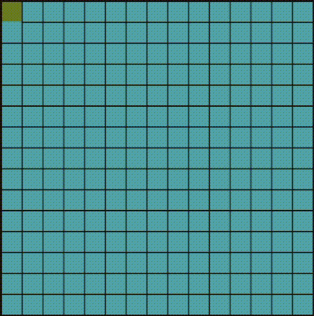
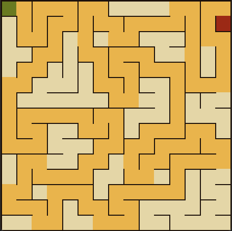
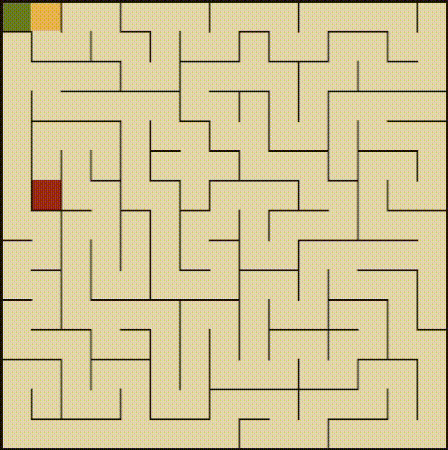
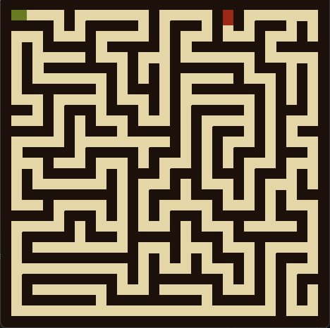
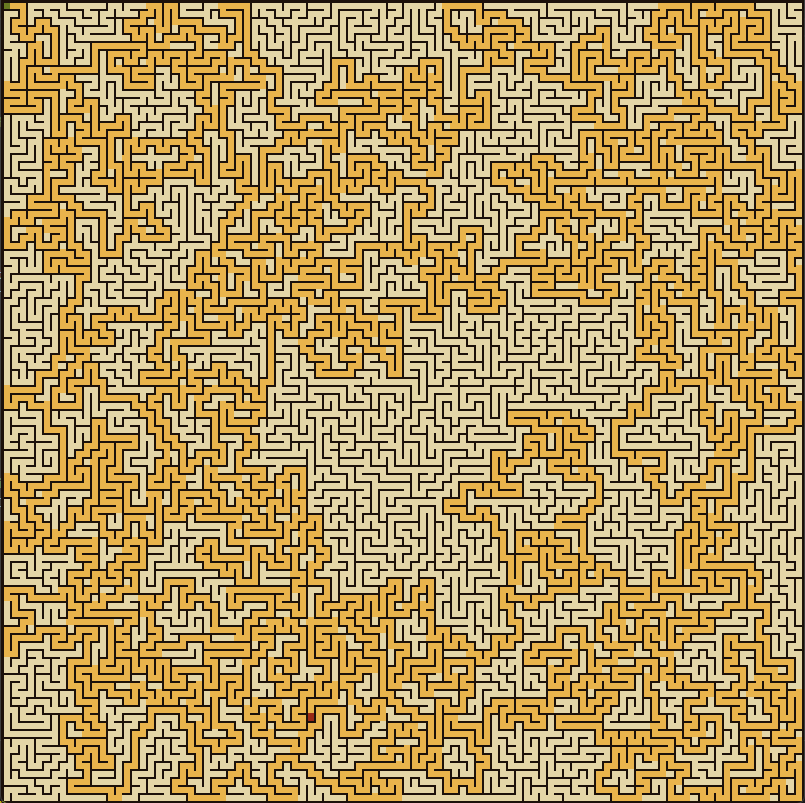

# Maze Builder

<!-- PROJECT LOGO -->
 

  

<h3 align="center">Maze Builder</h3>

  

     	A graphical maze generator utilizing a randomized depth-first search recursive backtracking algorithm.
     
    <a href="https://github.com/djsereno/Maze-Builder"><strong>Explore the docs »</strong></a>
     
    <a href="https://github.com/djsereno/Maze-Builder/issues">Report Bug</a>
    ·
    <a href="https://github.com/djsereno/Maze-Builder/issues">Request Feature</a>
  

<!-- TABLE OF CONTENTS -->

  
Table of Contents

  <ol>
    <li>
      <a href="#about-the-project">About The Project</a>
      <ul>
        <li><a href="#built-with">Built With</a></li>
      </ul>
    </li>
    <li><a href="#usage">Usage</a></li>
    <li><a href="#roadmap">Roadmap</a></li>
    <li><a href="#contributing">Contributing</a></li>
    <li><a href="#contact">Contact</a></li>
    <li><a href="#acknowledgments">Acknowledgments</a></li>
  </ol>

<!-- ABOUT THE PROJECT -->

## About The Project

This algorithm, also known as the "[recursive backtracker](https://en.wikipedia.org/wiki/Maze_generation_algorithm#Randomized_depth-first_search)" algorithm, is a randomized version of the depth-first search algorithm. Consider the space for a maze being a large grid of cells (like a large chess board), each cell starting with four walls. 

1. Starting from an initial cell, select a random neighboring cell that has not yet been visited. 
2. Remove the wall between the two cells and mark the new cell as visited.
3. Add the new cell to the stack to facilitate backtracking. 
4. Continue this process until the current cell has no unvisited neighbors (i.e. a dead-end). 
5. When a dead-end has been reached, backtrack through the path until reaching a cell with an unvisited neighbor. 
6. Visit the unvisited neighbor, and repeat steps 2 through 5 until every cell has been visited.

The cell which results in the longest path from the initial cell is saved as the 'end cell' or 'target cell', and the associated path to reach that cell is saved as the solution to the maze.

Mazes generated with a depth-first search have a low branching factor and contain many long corridors because the algorithm explores as far as possible along each branch before backtracking. 

(<a href="#top">back to top</a>)

### Built With

* [Python](https://www.python.org/)
* [PyGame](https://www.pygame.org/)

(<a href="#top">back to top</a>)

<!-- USAGE EXAMPLES -->

## Usage

In `settings.py`, there are several settings that control the behavior of the maze builder.

### Visual Settings
* **animate**: 
    * `True`: Animate the maze builder, extending the maze path by one cell per frame. 
    * `False`: Only the final maze will be displayed.

    

* **showSolution**:
    * `True`: Show the solution path from maze start to end once the maze has been generated. 
    * `False`: No solution displayed.

    

* **animateSolution**:
    * `True`: Animate the solution path. Note: Only applicable if `showSolution` is `True`.
    * `False`: Display a static solution path.

    

* **hedgeMode**:
    * `True`: Mazes with 'hedge mode' enabled have walls that are the same thickness as the maze path, similar to a hedge maze or corn maze. 
    * `False`: Thin lines separate maze paths.

    

### Grid settings
* **cellSize**: The side dimension (in pixels) of a single cell of the maze.
* **numRows**: The horizontal dimension (in cells) of the maze.
* **numCols**: The vertical dimension (in cells) of the maze.

    
    
<em>A 100x100 maze.</em>

Other settings, such as color settings, can also be found in `settings.py`.

(<a href="#top">back to top</a>)

<!-- ROADMAP -->

## Roadmap

- [ ] Allow the user to select a target end cell.
- [ ] Allow the user to draw obstacles which the maze must be generated around so that picture mazes can be created.
- [ ] Implement a UI to more easily define maze parameters.
- [ ] Implement other maze generation algorithms.
- [ ] More interesting animations.
- [ ] Sounds?

See the [open issues](https://github.com/djsereno/Maze-Builder/issues) for a full list of proposed features (and known issues).

(<a href="#top">back to top</a>)

<!-- CONTRIBUTING -->

## Contributing

If you have a suggestion that would make this better, please fork the repo and create a pull request. You can also simply open an issue with the tag "enhancement".
Don't forget to give the project a star! Thanks again!

1. Fork the Project
2. Create your Feature Branch (`git checkout -b feature/AmazingFeature`)
3. Commit your Changes (`git commit -m 'Add some AmazingFeature'`)
4. Push to the Branch (`git push origin feature/AmazingFeature`)
5. Open a Pull Request

(<a href="#top">back to top</a>)

<!-- CONTACT -->

## Contact

Derek Sereno - [LinkedIn](https://www.linkedin.com/in/dereksereno/) - [Email](mailto:djsereno91@gmail.com)

Project Link: [https://github.com/djsereno/Maze-Builder](https://github.com/djsereno/Maze-Builder)

(<a href="#top">back to top</a>)

<!-- ACKNOWLEDGMENTS -->

## Acknowledgments

- [Maze generation algorithm](https://en.wikipedia.org/wiki/Maze_generation_algorithm#Randomized_depth-first_search) from [Wikipedia](https://en.wikipedia.org)

(<a href="#top">back to top</a>)
